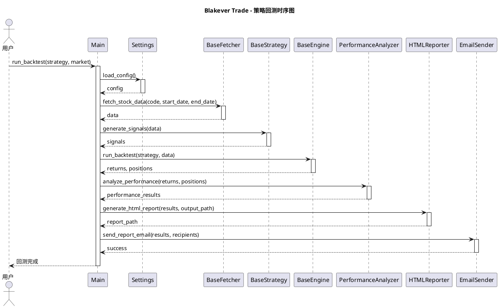
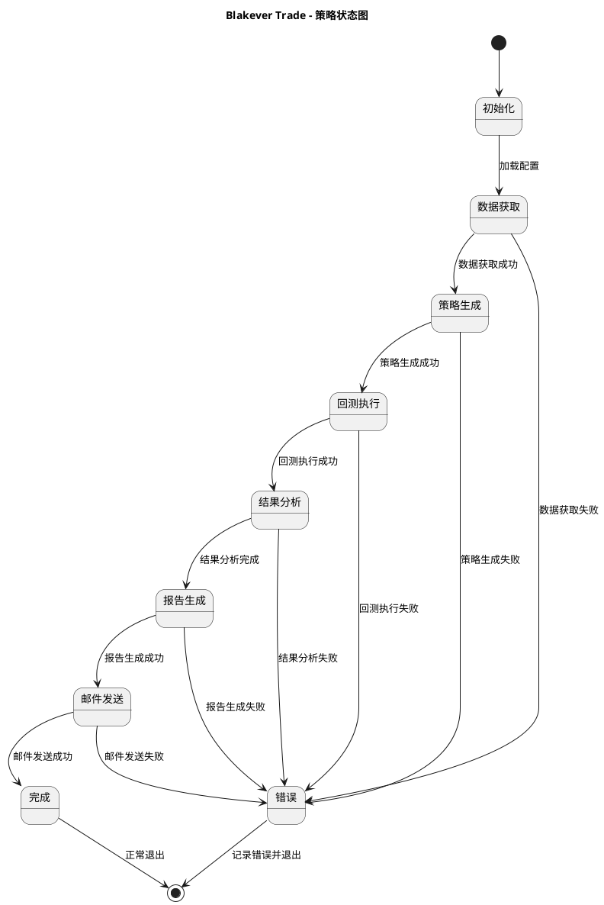

# Blakever Trade - 项目UML类图

## 📊 项目结构UML类图

```plantuml
@startuml
!define LIGHTBLUE #E1F5FE
!define LIGHTGREEN #E8F5E9
!define LIGHTYELLOW #FFF9C4
!define LIGHTORANGE #FFE0B2
!define LIGHTPURPLE #E1BEE7

title Blakever Trade - 量化投资策略研究与回测系统

'==========================
' 配置模块 (config/)
'==========================
package "config" as config LIGHTBLUE {
    class Settings {
        +PATHS: dict
        +DATA_SOURCES: dict
        +BACKTEST_CONFIG: dict
        +EMAIL_CONFIG: dict
        +LOG_CONFIG: dict
    }

    class MarketConfig {
        +A_STOCK_CONFIG: dict
        +HK_STOCK_CONFIG: dict
        +US_STOCK_CONFIG: dict
        +ETF_CONFIG: dict
    }

    class StrategyParams {
        +EMA_ADX_PARAMS: dict
        +MACD_PARAMS: dict
        +RSI_PARAMS: dict
        +ALPHA_FACTOR_PARAMS: dict
        +BLAKEVER_PARAMS: dict
    }

    Settings -- MarketConfig
    Settings -- StrategyParams
}

'==========================
' 数据层 (data/)
'==========================
package "data" as data LIGHTGREEN {
    package "fetchers" as fetchers {
        class BaseFetcher {
            +fetch_stock_data(code, start_date, end_date)
            +fetch_index_data(code, start_date, end_date)
            +fetch_etf_data(code, start_date, end_date)
        }

        class JQDataFetcher {
            +login()
            +fetch_stock_data(code, start_date, end_date)
            +fetch_financial_data(code, year, quarter)
        }

        class WestockFetcher {
            +fetch_kline(code, period, limit)
            +fetch_realtime_quote(code)
        }

        class AKShareFetcher {
            +fetch_stock_data(code, start_date, end_date)
            +fetch_etf_data(code, start_date, end_date)
        }

        BaseFetcher <|-- JQDataFetcher
        BaseFetcher <|-- WestockFetcher
        BaseFetcher <|-- AKShareFetcher
    }

    package "processors" as processors {
        class DataCleaner {
            +clean_data(df)
            +handle_missing_values(df)
            +remove_outliers(df)
        }

        class DataValidator {
            +validate_data(df)
            +check_data_quality(df)
        }

        class DataTransformer {
            +normalize_data(df)
            +calculate_returns(df)
            +calculate_indicators(df)
        }
    }

    package "storage" as storage {
        class CSVStorage {
            +save_to_csv(df, file_path)
            +load_from_csv(file_path)
        }

        class DatabaseStorage {
            +save_to_db(df, table_name)
            +load_from_db(table_name, conditions)
        }
    }
}

'==========================
' 因子层 (factors/)
'==========================
package "factors" as factors LIGHTYELLOW {
    class BaseFactor {
        +calculate(data)
        +normalize(factor_values)
    }

    class ValueFactors {
        +calculate_pe(data)
        +calculate_pb(data)
        +calculate_ps(data)
    }

    class QualityFactors {
        +calculate_roe(data)
        +calculate_roa(data)
        +calculate_gross_margin(data)
    }

    class GrowthFactors {
        +calculate_revenue_growth(data)
        +calculate_profit_growth(data)
        +calculate_eps_growth(data)
    }

    class MomentumFactors {
        +calculate_return_1m(data)
        +calculate_return_3m(data)
        +calculate_return_12m(data)
    }

    BaseFactor <|-- ValueFactors
    BaseFactor <|-- QualityFactors
    BaseFactor <|-- GrowthFactors
    BaseFactor <|-- MomentumFactors
}

'==========================
' 策略层 (strategies/)
'==========================
package "strategies" as strategies LIGHTORANGE {
    class BaseStrategy {
        +generate_signals(data)
        +calculate_position_size(data)
        +set_stop_loss(data)
        +set_take_profit(data)
    }

    package "etf" as etf {
        class AlphaFactorStrategy {
            +generate_signals(data)
            +select_stocks(factors, top_n)
        }

        class MultiStrategyFOF {
            +generate_signals(data)
            +combine_strategies(strategies, weights)
        }

        class SevenStarLaplacian {
            +generate_signals(data)
            +calculate_laplacian_gaussian(data)
        }

        class SevenStarSanma {
            +generate_signals(data)
            +calculate_sanma_indicator(data)
        }
    }

    BaseStrategy <|-- AlphaFactorStrategy
    BaseStrategy <|-- MultiStrategyFOF
    BaseStrategy <|-- SevenStarLaplacian
    BaseStrategy <|-- SevenStarSanma
}

'==========================
' 回测层 (backtest/)
'==========================
package "backtest" as backtest LIGHTPURPLE {
    package "engines" as engines {
        class BaseEngine {
            +run_backtest(strategy, data)
            +calculate_returns(positions, prices)
        }

        class VectorBTEngine {
            +run_backtest(strategy, data)
            +optimize_parameters(strategy, data, param_grid)
        }

        class TALibEngine {
            +run_backtest(strategy, data)
            +calculate_indicators(data)
        }
    }

    package "metrics" as metrics {
        class ReturnsMetrics {
            +calculate_total_return(returns)
            +calculate_annualized_return(returns)
            +calculate_sharpe_ratio(returns, risk_free_rate)
        }

        class RiskMetrics {
            +calculate_max_drawdown(returns)
            +calculate_volatility(returns)
            +calculate_beta(returns, market_returns)
        }
    }

    package "analyzers" as analyzers {
        class PerformanceAnalyzer {
            +analyze_performance(returns, positions)
            +generate_performance_report(results, output_path)
        }

        class BullPeriodAnalyzer {
            +analyze_bull_periods(returns, market_returns)
            +compare_v1_vs_v2(returns_v1, returns_v2)
        }
    }
}

'==========================
' 优化层 (optimization/)
'==========================
package "optimization" as optimization {
    package "correlation" as correlation {
        class CorrelationAnalyzer {
            +calculate_correlation(returns)
            +plot_correlation_heatmap(corr_matrix, output_path)
            +find_low_correlation_combinations(returns, threshold)
        }
    }

    package "weight" as weight {
        class MarkowitzOptimizer {
            +optimize_weights(returns, method)
            +calculate_efficient_frontier(returns)
        }

        class RiskParityOptimizer {
            +optimize_weights(returns)
            +calculate_risk_contribution(weights, cov_matrix)
        }
    }

    package "parameter" as parameter {
        class GridSearch {
            +optimize(strategy, data, param_grid)
            +cross_validate(strategy, data, param_grid)
        }

        class StepOptimizer {
            +optimize_step_by_step(strategy, data, steps)
            +analyze_step_results(results, output_path)
        }
    }
}

'==========================
' 组合层 (portfolio/)
'==========================
package "portfolio" as portfolio {
    class FOFConstructor {
        +construct_fof(returns, strategies, method)
        +optimize_weights(returns, method)
        +rebalance_portfolio(returns, weights, frequency)
    }

    class PositionManager {
        +calculate_position_size(account_value, risk_per_trade)
        +manage_position(positions, market_conditions)
    }

    class Rebalancer {
        +rebalance_portfolio(weights, current_positions)
        +calculate_turnover(old_weights, new_weights)
    }
}

'==========================
' 报告层 (reporting/)
'==========================
package "reporting" as reporting {
    class HTMLReporter {
        +generate_html_report(results, output_path)
        +plot_equity_curve(returns, output_path)
        +plot_drawdown(returns, output_path)
    }

    class EmailSender {
        +send_email(subject, body, attachments)
        +send_report_email(results, recipients)
    }

    class AlertSystem {
        +check_risk_alert(returns, threshold)
        +send_alert(alert_type, message)
    }
}

'==========================
' 工具层 (utils/)
'==========================
package "utils" as utils {
    class Logger {
        +get_logger(name)
        +set_log_level(level)
    }

    class Decorators {
        +time_it(func)
        +log_it(func)
        +handle_exceptions(func)
    }

    class MathUtils {
        +calculate_sharpe_ratio(returns, risk_free_rate)
        +calculate_sortino_ratio(returns, risk_free_rate)
        +calculate_calmar_ratio(returns)
    }

    class TimeUtils {
        +get_trading_dates(start_date, end_date)
        +is_trading_day(date)
        +get_next_trading_day(date)
    }
}

'==========================
' 主入口 (main.py)
'==========================
class Main {
    +print_banner()
    +check_environment()
    +run_backtest(strategy, market)
    +run_optimization(strategy, method)
    +send_report(format)
}

'==========================
' 关系定义
'==========================
' 主入口依赖配置
Main --> Settings
Main --> MarketConfig
Main --> StrategyParams

' 策略层依赖数据层
BaseStrategy --> BaseFetcher
AlphaFactorStrategy --> BaseFetcher
AlphaFactorStrategy --> BaseFactor

' 回测层依赖策略层
BaseEngine --> BaseStrategy
VectorBTEngine --> BaseStrategy

' 优化层依赖回测层
GridSearch --> BaseEngine
StepOptimizer --> BaseEngine

' 组合层依赖优化层
FOFConstructor --> CorrelationAnalyzer
FOFConstructor --> MarkowitzOptimizer

' 报告层依赖回测层
HTMLReporter --> PerformanceAnalyzer
EmailSender --> HTMLReporter

' 工具层被所有层使用
Settings --> Logger
Main --> Logger
@enduml
```



## 📊 项目功能模块UML用例图

```plantuml
@startuml
!define LIGHTBLUE #E1F5FE
!define LIGHTGREEN #E8F5E9

title Blakever Trade - 功能用例图

actor "用户" as user
actor "系统" as system

'==========================
' 数据获取用例
'==========================
package "数据获取" as data_fetch LIGHTBLUE {
    usecase "获取股票数据" as UC1
    usecase "获取指数数据" as UC2
    usecase "获取ETF数据" as UC3
    usecase "获取财务数据" as UC4
}

'==========================
' 策略回测用例
'==========================
package "策略回测" as backtest LIGHTGREEN {
    usecase "运行策略回测" as UC5
    usecase "生成交易信号" as UC6
    usecase "计算绩效指标" as UC7
    usecase "分析回测结果" as UC8
}

'==========================
' 策略优化用例
'==========================
package "策略优化" as optimization {
    usecase "参数优化" as UC9
    usecase "权重优化" as UC10
    usecase "相关性分析" as UC11
    usecase "分步优化" as UC12
}

'==========================
' 组合构建用例
'==========================
package "组合构建" as portfolio {
    usecase "构建FOF组合" as UC13
    usecase "优化组合权重" as UC14
    usecase "再平衡组合" as UC15
}

'==========================
' 报告生成用例
'==========================
package "报告生成" as reporting {
    usecase "生成HTML报告" as UC16
    usecase "生成CSV报告" as UC17
    usecase "发送邮件报告" as UC18
    usecase "风险预警" as UC19
}

'==========================
' 关系定义
'==========================
user --> UC1
user --> UC5
user --> UC9
user --> UC13
user --> UC16

UC1 --> UC2
UC1 --> UC3
UC1 --> UC4

UC5 --> UC6
UC5 --> UC7
UC5 --> UC8

UC9 --> UC10
UC9 --> UC11
UC9 --> UC12

UC13 --> UC14
UC13 --> UC15

UC16 --> UC17
UC16 --> UC18
UC16 --> UC19

system --> UC1
system --> UC5
system --> UC9
system --> UC13
system --> UC16
@enduml
```



## 📊 项目时序图



## 📊 项目状态图



## 📋 如何使用这些UML图

### 1. 在线查看
复制上面的PlantUML代码到以下网站查看：
- PlantUML官方：https://www.plantuml.com/plantuml
- PlantText：https://www.planttext.com/

### 2. 本地查看
安装PlantUML插件：
- VS Code：安装"PlantUML"插件
- IntelliJ：安装"PlantUML integration"插件

### 3. 导出图片
使用PlantUML命令行工具导出为PNG/SVG：
```bash
plantuml -tpng docs/PROJECT_UML.md
plantuml -tsvg docs/PROJECT_UML.md
```

## 📞 说明

1. **类图**：展示了项目中各模块、类、接口之间的关系
2. **用例图**：展示了系统的功能需求和用户交互
3. **时序图**：展示了策略回测过程中的对象交互
4. **状态图**：展示了策略执行过程中的状态转换

这些UML图可以帮助你更好地理解项目结构、功能模块之间的关系，以及系统的运行流程。
